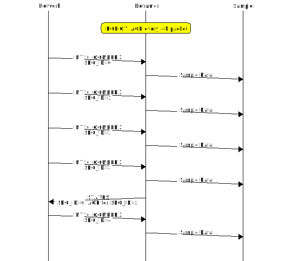
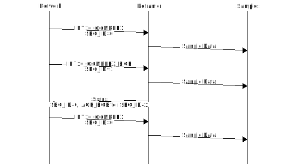
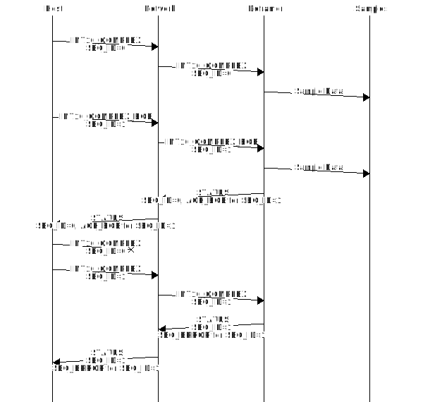
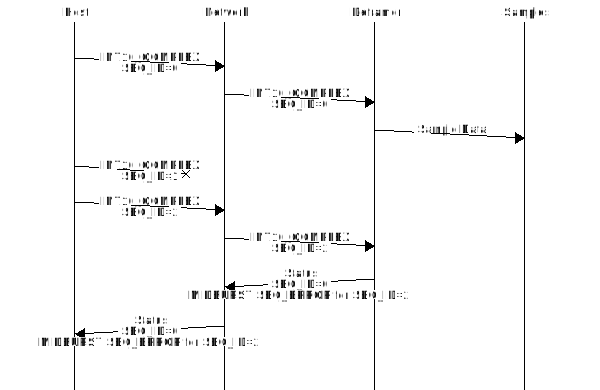
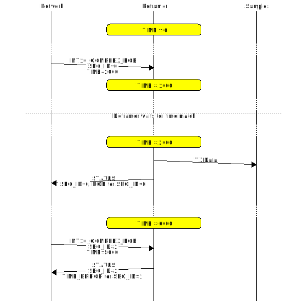
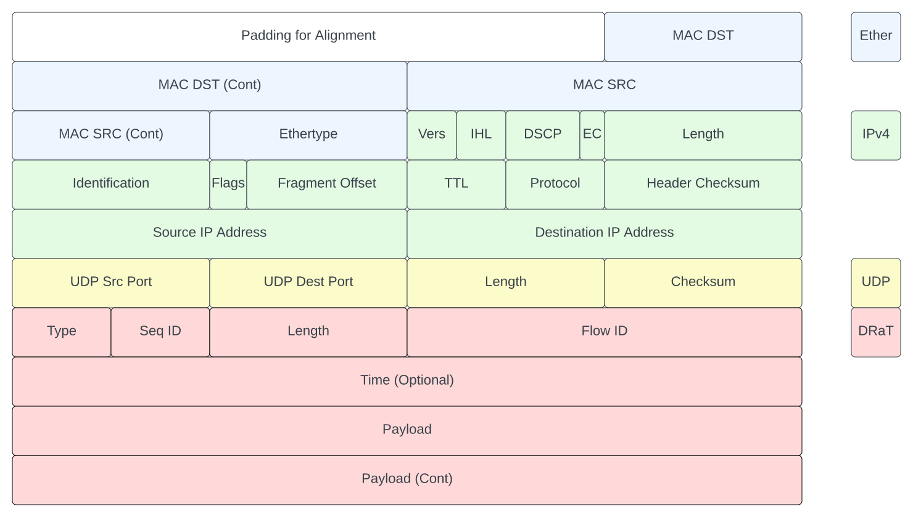
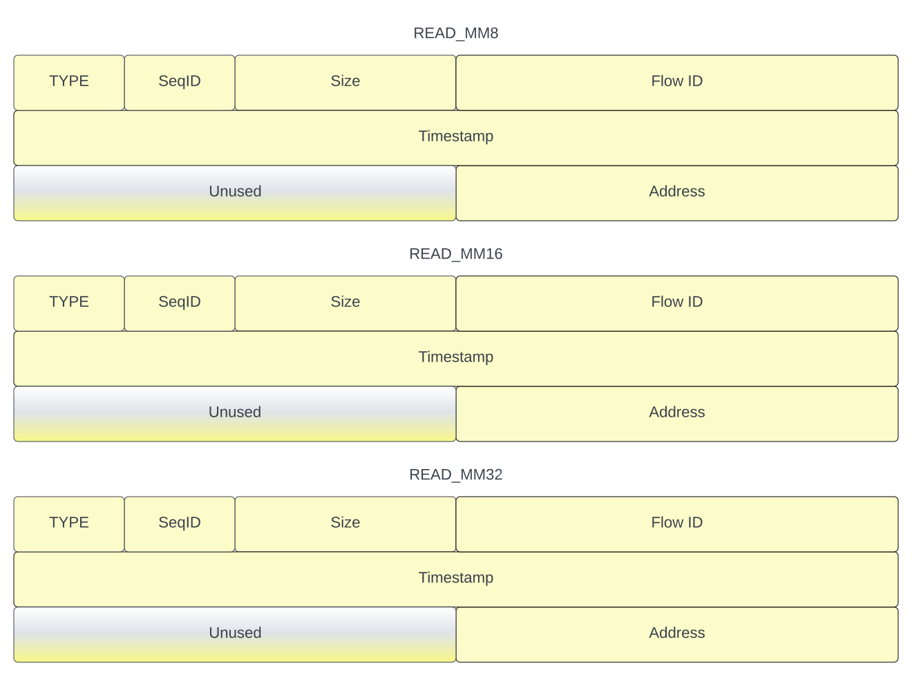
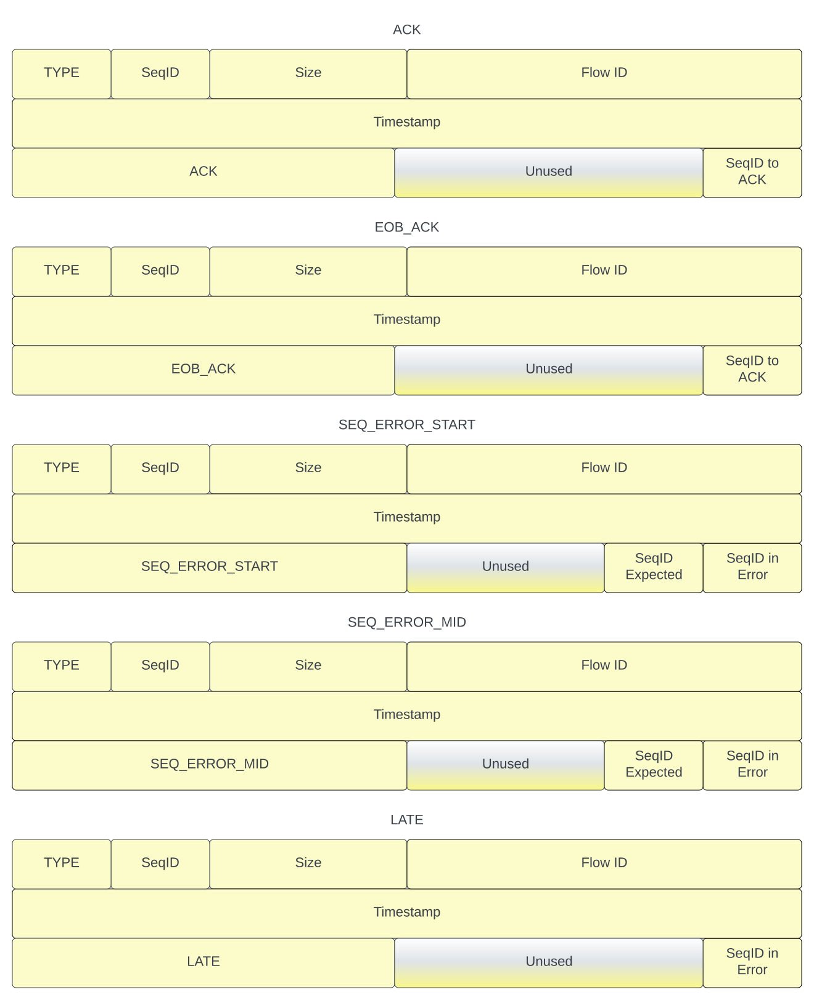
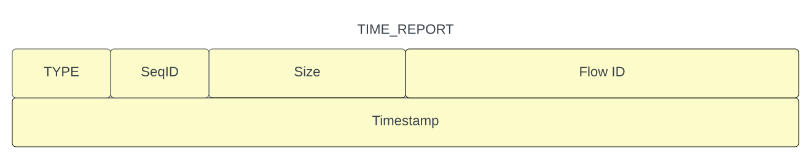

# DRaT

DRaT, the Digital Radio Transport, is an attempt to design a transport protocol focused on contempary digital radio design challenges. Envisaged implementations fuse SDR (Software Defined Radio) processing with NoC (Network-on-Chip) enabled DSP, to tackle problems such as coherency, Phased array and MIMO processing, and Ghz level bandwiths. Historically the VITA49.x protocol group contains a lot of header fields that have largely constant or unused fields and largely avoided any control plane functionality. The Ettus research USRP3 architecture evolved this with a packet transport named CHDR that compresses and eliminates certain VITA49 fields for more efficient bandwidth utilization whilst facilitating NoC style implementations. DRaT continues this evolution with support for more data plane payload types, and extending control plane functionality within the protocol.

### Concepts

#### Streams

A stream denotes a sample flow between two end points, where an end point is defined as a H/W defined I/Q sample interface, a host computer S/W defined sample interface, or a muticast distribution group (to many end points).

#### Bursts

A burst denotes a time continious series of samples contained within a stream. A burst can be of known finite length or of unknown indefinite length. Samples within a burst shall be equally spaced in time, being associated with a nominal sample rate.

### Error Conditions

#### Underflow

The scheduled on-air time of transmitted sample data is utterly inflexible. When data plane packets containing sample data have failed to arrive within the Radio by the nominal on-air time for there contained sample data then underflow is the result. The typical root causes of underflow are numerous; Host CPU scheduling, Host computational overload, network congestion or propagation delays. Typical H/W contains large sample buffers to minimize the possibility of underflow, but it is always a possibility in an SDR host processing based system. DiRT implementations of DRaT supports various programmable policies to control error recovery in this situation.
Upon detection of underfow, the H/W transitions into an error state, ceases transmission, and signals underflow in a status message to the host. Recovery from an error state is discussed in XXXX.

#### Overflow

Overflow is generally the result of the failure SDR host based processing to match the incomming receive sample rate. Buffering on reception occurs mostly inside Host RAM (Either OS or userspace). Local buffering in H/W is typically provided only to the degree needed to provide for efficient packetization, local transport and congestion within the H/W, and anticipated protocol jitter and latency.

### Status and Error Reporting

The DRaT protocol provides for status and error handling and reporting for a number of common situations that can occur with bursts of sample transport packets. Errors and acknowledgments are reported back to the upstream source using various types of STATUS packet subtypes. STATUS packets include a 64bit Time that timestamps when the packet was actually generated, a status or error code, and the sequence ID of the sample transport packet that triggered the STATUS packet. The layout of the STATUS packet is shown in XXXX.

#### Status and Error Codes.

##### ACK

ACK can be issued for any non-error packet except the last packet in a burst and serves to timestamp the moment that a packet is fully consumed by the sink of the packet flow. Whilst all packets could generate an ACK response, in general implementations allow ACK to be generated every Nth sample data Packet and/or after a timed interval expires. 

##### ACK_EOB

ACK_EOB is issued when a DRaT sample data packet signaling EOB, for example INT16_COMPLEX_EOB, is fully consumed by the Defamer at a Flow Sink.

##### SEQ_ERROR_START

Sequence Error Start (SEQ_ERROR_START) is issued when there is a sequence ID discontinuity at the start of a new burst (i.e previous packet had EOB flag set). Bursts in DRaT are defined to always start with the sequenceID set to 0.

##### SEQ_ERROR_MID

Similar to a SEQ_ERROR_START, a Sequence ID discontinuity is detected, however in this case within a burst (i.e on any packet except the first packet in a burst).

##### LATE

The LATE error is issued when a packet that starts a new burst for transmission arrives at the Sink with a Timestamp for a time already in the past. Note that timestamps might also be compared as part of a sink re-synchronization after an error state such as lost packets, though whether this could lead to a corner case that could trigger late packet would be down to implementation specifics.

### Source Flow Control

At a H/W level there is extensive use of streaming point-to-point links within DiRT that use low level H/W to ready-valid handshake at each hop. However individual dataflows also require end-to-end flow control. The need for end-to-end flow control is driven by two main factors:

- Head of line blocking. If multiple dataflows are multiplexed over a shared point-to-point link, then the packets that form these dataflows are serialized at the packet level. If one of the dataflows begins to be back pressured from itʼs ultimate sink as buffering fills, then this  in turn causes all dataflows that share segments of point-to-point links involved in the back pressured dataflow to also stall because the transmission of a packet over a link is a serialized operation and the stalled partially transmitted packet can not be preempted or moved aside to allow other unblocked dataflows to pass.
- Buffer management. A H/W implementation typically distributes elastic buffering throughout the pipeline, some of which is shared by multiple flows and some of which is dedicated to the buffering of a single flow. The occupancy of this buffer space needs to be efficiently managed for maximum performance. The buffering allows transport links, such as Ethernet that have high throughput and potentially high access latency, as well as multitasking application hosts which again have high throughput but also high latency, to interface losslessly with the inflexible sample clock driven radio frontend. Thus managing the occupancy of this elastic buffer space is important for a system to function correctly...if it empties completely during active streaming then underflow will result, if it becomes over full then head of line blocking will start occurring and eventually packets wil be lost to overflow. Because the capacity of the elastic buffering in given H/W, for any given dataflow, is well known, then occupancy can be managed by timely reporting of packet consumption at the dataflow sink back to the dataflow source, rather than monitoring the various buffers directly.

### Framing

The framing of DRaT is weighted by a desire to implement hardware using a 64bit wide streaming bus architecture. However in addition to being used in isolation on top of bare metal H/W, it is designed to be layered inside of other protocol transport mediums to provide conetctivity external to H/W implementations.

#### Encapsulation

DRaT is designed to be easy to ecapsulate in a surrounding transport. By convention it would be transported as part of a UDP/IP encapsulation, typically over ethernet between hosts and Radio H/W. Endianness follows normal IPv4 network byte order norms.

#### Framing Formats

DRaT attempts to use a very orthogonal packet encoding such that all defined framing formats and types largely use fields with the same bitfield boundaries and purpose, which enables H/W implementations to achieve higher clock speeds. Likewise where possible, framed bitfields use natural alignments to common datatype sizes to try to maximize microprocessor and software perfomance during parsing. A single octet sized type field provides for upto 256 different framing formats. DRaT formats currently supported widely in DiRT are listed here:

##### INT16_COMPLEX

Sample transport of IQ data in a 2's compliment fractional integer representation. Each sample componant represents a value -1 <= x < 1. Each packet in a burst has type INT16_COMPLEX (or INT16_COMPLEX_ASYNC is there is no valid timestamp) unitil the last  packet, which is type INT16_COMPLEX_EOB (or INT16_COMPLEX_ASYNC_EOB) to signal the end of the burst. The SeqID is reset to for the first packet in each new burst and is expected to increment modulo 256 with each new packet.

##### WRITE_MMxx

Create single beat memory-mapped write in 32bit (byte) address space. Writes should not cross alignment boundries so they map well to downstream generated AXI4Lite etc transactions.

##### READ_MMxx

Create a single beat memory-mapped read in 32bit (byte) address space. Reads should not cross alignment boundries so they map well to downstream generated AXI4Lite etc transactions. The Read RESPONSE_MMxx is returned in a different packet that reuses the SeqID of the Read request.

##### RESPONSE_MMxx

Read RESPONSE_MMxx packets for the various READ_MMxx packet types. SeqID is copied from the original Read request as a transaction ID.

##### STATUS

Various types of framing are returned for the different STATUS packet sub-types, normally including the SeqID of the original packet they relate to.

##### TIME_REPORT

The TIME_REPORT frame is used to report the current H/W system time to listeners so they can both add timestamps to synchornous Tx bursts and estimate current buffer fullness at H/W. It can be transported as unicast/multicast/broadcast IP/UDP as required by the system without any effect on DRaT framing and functionality. Typical systems will send the TIME_REPORT frame at regular intervals and frequently such that sample rates  and elastic buffers in use in the particular system will be cause buffering to absorb latencies and jitter inherant to the system, provding uninterupted sample bursts to data converters or other downstream processing. TIME_REPORT might orginate from a different place in the system than the sample stream sink/sources if time is managed coherantly across distributed H/W.

#### Data Notations

The convention in the documentation of Internet Protocols is to express numbers in decimal and to picture data in big-endian order, and DRat follows this convention.  That is, fields are described left to right, with the most significant octet on the left and the least significant octet on the right.

The order of transmission of the header and data described in this document is resolved to the octet level.  Whenever a diagram shows a group of octets, the order of transmission of those octets is the normal order in which they are read in English.  For example, in the following diagram the octets are transmitted in the order they are numbered.

  

Whenever an octet represents a numeric quantity the left most bit in the diagram is the high order or most significant bit.  That is, the bit labeled 0 is the most significant bit.  For example, the following diagram represents the value 170 (decimal).

Similarly, whenever a multi-octet field represents a numeric quantity the left most bit of the whole field is the most significant bit.  When a multi-octet quantity is transmitted the most significant octet is transmitted first.
